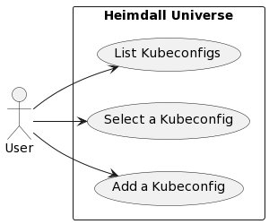

# Heimdall

## Description
Do you use CLI for kubernetes? How to you switch your N kubeconfig? Don't have a solution? Ok! USE HEIMDALL!

## Architecture
A simple user can perform three action:
- List all kubeconfigs (in ~/.kube path)
- Select a kubeconfig (from list)
- Add a kubeconfig (in ~/.kube path)

## Author
- Luca Maggio (lucamaggio1992@gmail.com)
